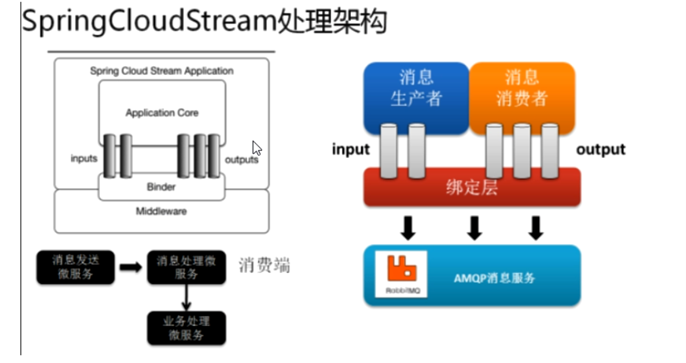

# cloud2020
# Eureka-自我保护机制
> 保护模式主要用于一组客户端和Eureka server之间存在网络分区场景下的保护，一旦进入保护模式，Eureka Server将会尝试保护其服务注册表中的信息，不再删除服务注册表中的数据，也就是不会注销任何微服务
>默认情况下EurekaClient 定时向EurekaServer端发送心跳包，如果server端在一定时间（默认90秒）没有收到EurekaClient发送心跳包，便会直接从服务器注册列表中剔除该服务，但是在短时间内（90秒中）内丢失了大量的服务器实例心跳，这时候EurekaServer会开启自我保护机制
 在cap理论里面属于 ap

使用eureka.server.enable-self-preservation = false可以禁用自我保护模式


# zookeeper 作为注册中心
> zookeeper是一个分布式协调工具，可以实现注册中心功能，保证ap，缺点是没有图形化管理界面

#  consul
> consule 是一套开源的分布式服务发现和配置管理系统,由HashiCorp公司用Go语言开发 
> 提供了微服务系统中的服务治理、配置中心、控制总线等功能。这些功能中每一个都可以根据需要
>单独使用，也可以一起使用构建全方位的服务网格

**优点** ：基于raft协议，简洁、支持健康检查、支持https和dns协议，支持跨数据中心平台，支持linux、mac、windows、支持可视化web界面

下载地址：https://www.consul.io/downloads.htm
相关教程：https://www.springcloud.cc/spring-cloud-consul.html

# Ribbon
> Ribbon是netfilx 发布的开源项目，主要是提供客户端的软件负载均衡算法和服务调用，Ribbon客户端组件组件是提供一系列完善的配置如:链接超时、重试、负载均衡等
>目前进入维护模式，未来替换spring cloud loand balance
>
>总结：Ribbon其实就是一个软负载均衡的客户端组件，他可以和其他所需请求的客户端结合使用，和eureka结合只是其中的一个实例。
>eureka 默认已经引入Ribbon
>
## 自定义负载均衡
> IRule:根据特定算法从服务列表中选取一个要访问的服务

* 轮询: com.netflix.loadbalancer.RoundRobinRule
* 随机: com.netflix.loadbalancer.RandomRule
* com.netflix.loadbalancer.RetryRule 先按照RoundRobinRule的策略获取服务，如果获取服务失败则在指定时间内会进行重试
* WeightedResponseTimeRule  对RoundRobinRule的扩展，响应速度越快的实例选择权重越大，越容易被选择
*BestAvailableRule 会先过滤掉由于多次访问故障而处于断路器跳闸状态的服务，然后选择一个并发量最小的服务
* AvailabilityFilteringRule 先过滤掉故障实例，再选择并发较小的实例
* ZoneAvoidanceRule 默认规则，复合判断server所在区域的性能和server的可用性选择服务器
注意： 自定义配置类不能放在@componentScan所扫描的当前包下以及子包下，否则我们自定义的配置类会被所有的Ribbon客户端锁共享，达不到特殊化制定的目的

创建自定义的类，再启动类增加注解@RibbonClient(name = "CLOUD-PAYMENT-SERVICE",configuration = MyselfRule.class)

# Fegin
> Feign是一个声明式的web服务客户端，让编写web服务客户端变得非常容易，只需创建一个接口并在接口上添加注解即可
> Feign 支持可插拔式的编码器和解码器，spring Cloud对feign进行了封装，使其支持了spring mvc标准注解和HttpMessageConverters.Fein可以与Eueka和Ribbon组合使用以支持负载均衡
>Feign集成了Ribbon 与Ribbon不同的是，通过Feign只需要定义服务绑定接口以声明式的方法，优雅的实现了服务调用**
## Fegin 与Open Fein的区别
feign ：是springcloud组件中的一个轻量级的restful的http服务客户端Feign内置了Ribbon，用来做客户端负载均衡，去调用服务注册中心的服务。 feign使用方式是：使用feign的注解定义接口，调用这个接口，就可以调用服务注册中心
OpenFein： 是springcloud在feign的基础上支持了springMvc的注解如@requestmapping等，OpenFeign的@FeginClient可以解析 springMVc的@requestMapping注解下的接口，并通过动态代理的方式产生实现类，实现类中做负载均衡调用其他服务
## openFeign超时控制
OpenFeign默认等待一秒钟，超过后报错,Feign整合了ribbon 所以只需配置
ribbon:
  ReadTimeout:  5000
  ConnectTimeout: 5000
 即可
 ## openFeign日志打印
 openfeign提供了日志打印功能。
 Logger有四种类型：NONE(默认，不显示任何日志)、BASIC(记录请求方法、URL、响应状态码、执行时间)、
 HEADERS(除了basic还有请求和响应头信息)、FULL(除header外还有请求和响应正文及元数据)，通过注册Bean来设置日志记录级别
 
 # Hystrix
 ## 介绍
 > 在微服务场景中，通常会有很多层的服务调用。如果一个底层服务出现问题，故障会被向上传播给用户。我们需要一种机制，当底层服务不可用时，可以阻断故障的传播。这就是断路器的作用。他是系统服务稳定性的最后一重保障。
   
 >  在springcloud中断路器组件就是Hystrix。Hystrix也是Netflix套件的一部分。他的功能是，当对某个服务的调用在一定的时间内（默认10s），有超过一定次数（默认20次）并且失败率超过一定值（默认50%），该服务的断路器会打开。返回一个由开发者设定的fallback。
   
 > fallback可以是另一个由Hystrix保护的服务调用，也可以是固定的值。fallback也可以设计成链式调用，先执行某些逻辑，再返回fallback。

## Hystrix的作用

1. 对通过第三方客户端库访问的依赖项（通常是通过网络）的延迟和故障进行保护和控制。

2. 在复杂的分布式系统中阻止级联故障。

3. 快速失败，快速恢复。

4. 回退，尽可能优雅地降级。

5. 启用近实时监控、警报和操作控制。

## Hystirx重要概念
###  服务降级
> 服务器忙，请稍候再试，不让客户端等待并立刻返回一个友好提示，fallback
**触发条件** ：程序运行异常、超时、服务熔断触发服务降级、线程池/信号量打满也会导致服务降级#
       
### 服务熔断
> 类比保险丝达到最大服务访问后，直接拒绝访问，拉闸限电，然后调用服务降级的方法并返回友好提示

### 服务限流
> 秒杀高并发等操作，严禁一窝蜂的过来拥挤，大家排队，一秒钟N个，有序进行

### 熔断机制概述
熔断机制是应对雪崩效应的一种微服务链路保护机制。当扇出链路的某个微服务出错不可用或者响应时间太长时，会进行服务的降级，进而熔断该节点微服务的调用，快速返回错误的响应信息。

当检测到该节点微服务调用响应正常后，恢复调用链路。
在Spring Cloud框架里， 熔断机制通过Hystrix实现。Hystrix会监控微服务间调用的状况，当失败的调用到一定阈值， 缺省是5秒内20次调用失败， 就会启动熔断机制。熔断机制的注解是@HysrixCommand. 

#### 短路器使用
    //服务熔断
    @HystrixCommand(fallbackMethod = "paymentCircuitBreaker_fallback",commandProperties = {
            @HystrixProperty(name = "circuitBreaker.enabled",value = "true"),  //是否开启断路器
            @HystrixProperty(name = "circuitBreaker.requestVolumeThreshold",value = "10"),   //请求次数
            @HystrixProperty(name = "circuitBreaker.sleepWindowInMilliseconds",value = "10000"),  //时间范围
            @HystrixProperty(name = "circuitBreaker.errorThresholdPercentage",value = "60"), //失败率达到多少后跳闸
    })
    //10秒钟 10次请求失败率达到60% 则开启熔断
    
 > Hystrix断路器使用时最常用的三个重要指标参数
   
    在微服务中使用Hystrix 作为断路器时，通常涉及到以下三个重要的指标参数（这里是写在@HystrixProperties注解中，当然实际项目中可以全局配置在yml或properties中）
    
    1. circuitBreaker.sleepWindowInMilliseconds
    
    断路器的快照时间窗，也叫做窗口期。可以理解为一个触发断路器的周期时间值，默认为10秒（10000）。
    
    2. circuitBreaker.requestVolumeThreshold
    
    断路器的窗口期内触发断路的请求阈值，默认为20。换句话说，假如某个窗口期内的请求总数都不到该配置值，那么断路器连发生的资格都没有。断路器在该窗口期内将不会被打开。
    
    3. circuitBreaker.errorThresholdPercentage
    
    断路器的窗口期内能够容忍的错误百分比阈值，默认为50（也就是说默认容忍50%的错误率）。打个比方，假如一个窗口期内，发生了100次服务请求，其中50次出现了错误。在这样的情况下，断路器将会被打开。在该窗口期结束之前，即使第51次请求没有发生异常，也将被执行fallback逻辑。
    
    综上所述，在以上三个参数缺省的情况下，Hystrix断路器触发的默认策略为：
    
    在10秒内，发生20次以上的请求时，假如错误率达到50%以上，则断路器将被打开。（当一个窗口期过去的时候，断路器将变成半开（HALF-OPEN）状态，如果这时候发生的请求正常，则关闭，否则又打开）
    
#### 断路器关闭的条件

1. 当满足一定阀值的时候（默认10秒内超过20个请求次数）
2. 当失败率达到一定的时候（默认10秒内超过50%请求失败）
3. 到达以上阀值，断路器将会开启
4. 当开启的时候，所有请求都不会进行转发
5. 一段时间之后（默认是5秒），这个时候断路器是半开状态，会让其中一个请求进行转发。如果成功，断路器会关闭，若失败，继续开启。重复4和5
#### 所有参数配置

### hystrix工作流程

步骤说明


### 服务监控HystixDashboard
#### 使用前提 
1. 新建HystixDashboard服务
2. 被监控的服务需要引入 mavn依赖
       ```
        <dependency>
                   <groupId>org.springframework.boot</groupId>
                   <artifactId>spring-boot-starter-web</artifactId>
               </dependency>
               <dependency>
                   <groupId>org.springframework.boot</groupId>
                   <artifactId>spring-boot-starter-actuator</artifactId>
               </dependency> 
       ```
3. 在被监控的服务添加配置（新版本）
 ```

    /**
     * 此配置为了服务监控而配置，与服务容错本身无关，springcloud升级后需要配置
     * servletRegistrationBean因为springboot默认的路径不是"/hystrix.stream"
     * 因此需要在自己的项目配置下面的servlet
     */
    @Bean
    public ServletRegistrationBean getServlet(){
        HystrixMetricsStreamServlet streamServlet = new HystrixMetricsStreamServlet();
        ServletRegistrationBean registrationBean = new ServletRegistrationBean(streamServlet);
        registrationBean.setLoadOnStartup(1);
        registrationBean.addUrlMappings("/hystrix.stream");
        registrationBean.setName("HystrixMetricsStreamServlet");
        return registrationBean;
    }
```
#### 示例

#### 说明


### Gateway新一代网关


#### 使用技术

 
#### 网关的作用
1. 反向代理
2. 鉴权
3. 流量控制
4. 熔断
5. 日志监控
#### 微服务网关


#### springcloud gateway特点

#### springcloud gateway工作流程


#### gateway网关路由配置方式
1. 代码文件yml配置
```spring:
     application:
       name: cloud-gateway
     cloud:
       gateway:
         routes:
         - id: payment_routh #路由的ID，没有固定规则但要求唯一，建议配合服务名
           uri: http://localhost:8001   #匹配后提供服务的路由地址
           predicates:
             - Path=/payment/get/**   #断言,路径相匹配的进行路由
   
         - id: payment_routh2
           uri: http://localhost:8001
           predicates:
             - Path=/payment/lb/**   #断言,路径相匹配的进行路由
   
```
2. 代码中注入RouteLocator的Bean

3. 常用的Route Predicate
    1.  After Route Predicate
    - After=2020-03-08T10:59:34.102+08:00[Asia/Shanghai]
    2. Before Route Predicate
      - After=2020-03-08T10:59:34.102+08:00[Asia/Shanghai]
       - Before=2020-03-08T10:59:34.102+08:00[Asia/Shanghai]
   3. Between Route Predicate
    - Between=2020-03-08T10:59:34.102+08:00[Asia/Shanghai] ,  2020-03-08T10:59:34.102+08:00[Asia/Shanghai]
    4. Cookie Route Predicate
      - Cookie=username,atguigu    #并且Cookie是username=zhangshuai才能访问
    5. Header Route Predicate
        - Header=X-Request-Id, \d+   #请求头中要有X-Request-Id属性并且值为整数的正则表达式
    6. Host Route Predicate
        - Host=**.atguigu.com
    7. Method Route Predicate
        - Method=GET
    8. Path Route Predicate
        - Path=/payment/get/**
    9. Query Route Predicate
        - Query=username, \d+ #要有参数名称并且是正整数才能路由
        ```
       server:
         port: 9527
       spring:
         application:
           name: cloud-gateway
         cloud:
           gateway:
             discovery:
               locator:
                 enabled: true  #开启从注册中心动态创建路由的功能，利用微服务名进行路由
             routes:
               - id: payment_routh #路由的ID，没有固定规则但要求唯一，建议配合服务名
                 #uri: http://localhost:8001   #匹配后提供服务的路由地址
                 uri: lb://cloud-payment-service
                 predicates:
                   - Path=/payment/get/**   #断言,路径相匹配的进行路由
        
               - id: payment_routh2
                 #uri: http://localhost:8001   #匹配后提供服务的路由地址
                 uri: lb://cloud-payment-service
                 predicates:
                   - Path=/payment/lb/**   #断言,路径相匹配的进行路由
                   #- After=2020-03-08T10:59:34.102+08:00[Asia/Shanghai]
                   #- Cookie=username,zhangshuai #并且Cookie是username=zhangshuai才能访问
                   #- Header=X-Request-Id, \d+ #请求头中要有X-Request-Id属性并且值为整数的正则表达式
                   #- Host=**.atguigu.com
                   #- Method=GET
                   #- Query=username, \d+ #要有参数名称并且是正整数才能路由
        
        
       eureka:
         instance:
           hostname: cloud-gateway-service
         client:
           service-url:
             register-with-eureka: true
             fetch-registry: true
             defaultZone: http://eureka7001.com:7001/eureka

       ```
#### Filter的使用
 生命周期只有pre post 业务逻辑之前，业务逻辑之后 
 
 两种filter
 单一：GatewayFilter 有31种
 全局：GlobalFilter 
 ##### 自定义过滤器
    自定义全局GlobalFilter
    实现两个 impiemerts   GlobalFilter ，Ordered
    进行 全局日志记录 统一网关鉴权

### config配置中心
1. 引入依赖
``` <dependency>
               <groupId>org.springframework.cloud</groupId>
               <artifactId>spring-cloud-config-server</artifactId>
           </dependency>
```
2. 增加配置
```yaml
spring:
  application:
    name: cloud-config-center
  cloud:
    config:
      server:
        git:
          uri: git@github.com:wangkaistudy/sprincloud-config.git # github地址
          #搜索目录
          search-paths:
            - springclo|ud-config
#      读取分支
      label: master
```
4. 配置读取规则
```
/{label}/{application}-{profile}.yml（最推荐使用这种方式）
master分支
http://127.0.0.1:3344/master/config-dev.yml
http://127.0.0.1:3344/master/config-test.yml
http://127.0.0.1:3344/master/config-prod.yml
dev分支
http://127.0.0.1:3344/dev/config-dev.yml
http://127.0.0.1:3344/dev/config-test.yml
http://127.0.0.1:3344/dev/config-prod.yml
/{application}-{profile}.yml
http://127.0.0.1:3344/config-dev.yml
http://127.0.0.1:3344/config-test.yml
http://127.0.0.1:3344/config-prod.yml
http://127.0.0.1:3344/config-xxxx.yml(不存在的配置)
/{application}-{profile}[/{label}]
http://127.0.0.1:3344/config/dev/master
http://127.0.0.1:3344/config/test/master
http://127.0.0.1:3344/config/prod/master

```
label：分支（branch）
name:服务名
profiles:环境（dev/test/prod）
#### bootstap.yml


#### 客户端配置
参考 cloud-config-client-3355服务

#### 动态刷新
##### 手动刷新
1. 增加bootstrap.yml配置
```yaml
management:
  endpoints:
    web:
      exposure:
        include: "*"
```
2. 在相关业务类增加 @RefreshScope//配置刷新
3. post请求访问curl -X POST "http://localhost:3355/actuator/refresh
4. 相关配置即可以自动刷新

## 自动刷新SpringCloud Bus 消息总线
> 分布式自动刷新配置功能
>Spring Cloud Bus配合Spring Cloud Config使用可以实现配置的动态刷新

作用

### 什么是总线 


### 14.3.3 设计思想
1. 利用消息总线触发一个客户端/bus/refresh,而刷新所有客户端的配置

2. 利用消息总线触发一个服务端ConfigServer的/bus/refresh端点,而刷新所有客户端的配置()


图二的架构显然更加合适，图一不适合的原因如下
打破了微服务的职责单一性，因为微服务本身是业务模块，它本不应该承担配置刷新职责
破坏了微服务各节点的对等性
有一定的局限性。例如，微服务在迁移时，它的网络地址常常会发生变化，此时如果想要做到自动刷新，那就会增加更多的修改

#### 应用
1. cloud-config-center-3344配置中心服务端添加消息总线支持POM
        ```xml
    <dependency>
                <groupId>org.springframework.cloud</groupId>
                <artifactId>spring-cloud-starter-bus-amqp</artifactId>
    </dependency>
    ```
    修改yml
    rabbitmq:
        host: localhost
        port: 5672
        username: guest
        password: guest
   management:
     endpoints:
       web:
         exposure:
           include: 'bus-refresh'


2. 给cloud-config-center-3355客户端添加消息总线支持   POM
     ```xml
    <dependency>
                <groupId>org.springframework.cloud</groupId>
                <artifactId>spring-cloud-starter-bus-amqp</artifactId>
    </dependency>
    ```
    修改yml
    rabbitmq:
        host: localhost
        port: 5672
        username: guest
        password: guest
3. 给cloud-config-center-3366客户端添加消息总线支持   POM
     ```xml
    <dependency>
                <groupId>org.springframework.cloud</groupId>
                <artifactId>spring-cloud-starter-bus-amqp</artifactId>
    </dependency>
    ```
    修改yml
    rabbitmq:
        host: localhost
        port: 5672
        username: guest
        password: guest
#### 配置更新（全局）
 1. 使用post请求访问配置中心 curl -X POST "http://localhost:3344/actuator/bus-refresh"
 2. 各个配置中心客户端参数配置
 
#### 配置更新（指定）
> http://localhost:配置中心的端口号/actuator/bus-refresh/{destination}
  /bus/refresh请求不再发送到具体的服务实例上，而是发给config server并通过destination参数类指定需要更新配置的服务或实例

如在本项目中只通知3366客户端
POST http://localhost:3344/actuator/bus-refresh/cloud-config-client:3366
#### bus流程


### cloud Stream
什么是消息驱动

屏蔽底层消息中间件的差异，降低切换版本，统一消息的编程模型

为什么用cloud Stream


底层原理


Binder


通过自定义Binder作为中间层，实现了应用程序与消息中间件细节之间的隔离

INPUT：对应消费者
OUTPUT：对应生产者
Stream中的消息通信方式遵循了发布-订阅模式

##### Topic主题进行广播
在RabbitMQ就是Exchange
在kafka中就是Topic

####  Spring Cloud Stream标准流程套路


##### Binder
很方便的连接中间件，屏蔽差异
##### Channel
通道，是队列Queue的一种抽象，在消息通讯系统中就是实现存储和转发的媒介，通过对Channel对队列进行配置
##### Source和Sink
简单的可理解为参照对象是Spring Cloud Stream自身，从Stream发布消息就是输出，接受消息就是输入
####  编码API和常用注解


#### 示例
具体看 cloud-stream-rabbitmq-consumer8803 cloud-stream-rabbitmq-consumer8802 cloud-stream-rabbitmq-provider8801

#### 分组
原理： 微服务应用放置于同一个group中，就能够保证消息只会被其中一个应用消费一次。不同的组是可以消费的，同一个组内会发生竞争关系，只有其中一个可以消费。
8802/8803都变成不同组，group两个不同
1. 8802修改YML
    group:  claywangA
 
2. 8803修改YML
   group: claywangB
   
3. 访问RabbitMQ   
.jpg)

分别创建两个不同的queue 绑定交换机 如果group相同则消费同一个queue（rabbitmq 如果使用kafka则利用kafka的group属性）

#### 持久化
group属性能保证消息不丢失，当有group属性时 如在接受消息时down机重启后还能消费down机期间的消息
如若没有group属性则不能消费到down机期间消息

### [SpringCloud Sleuth](https://github.com/spring-cloud/spring-cloud-sleuth)
产生条件

https://github.com/spring-cloud/spring-cloud-sleuth
Spring Cloud Sleuth提供了一套完整的服务跟踪的解决方案
在分布式系统中提供追踪解决方案并且兼容支持了zipkin

sleuth负责收集整理zipkin负责展现

### zipkin搭建
1. 下载[zipkin server](https://dl.bintray.com/openzipkin/maven/io/zipkin/java/zipkin-server/)
2. 启动java -jar zipkin-server-2.12.9-exec.jar
3. 访问控制台http://localhost:9411/zipkin/

#### 调用链路

精简后


Trace:类似于树结构的Span集合，表示一条调用链路，存在唯一标识
span:表示调用链路来源，通俗的理解span就是一次请求信息

#### 使用
1. 在相应服务上添加依赖 如cloud-provider-payment8001、cloud-consumer-order80
    ```xml
   <!--包含了sleuth+zipkin-->
           <dependency>
               <groupId>org.springframework.cloud</groupId>
               <artifactId>spring-cloud-starter-zipkin</artifactId>
           </dependency>

    ```
2. 修改配置文件
    ```yaml
    spring:
      application:
        name: cloud-provider-payment
      zipkin:
        base-url: http://localhost:9411 #9411为zipkin本地服务端
      sleuth:
        sampler:
        #采样率值介于 0 到 1 之间，1 则表示全部采集 一般使用0.5
        probability: 1
    ```
3. 打开浏览器访问:http:localhost:9411


## SpringCloud Alibaba 